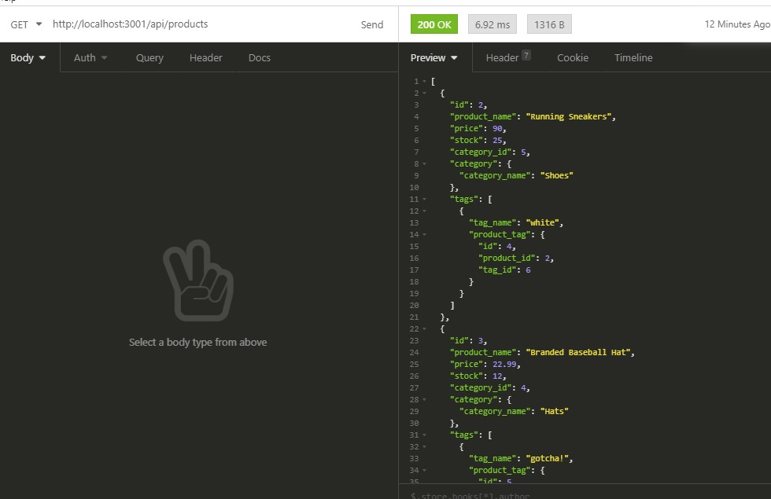
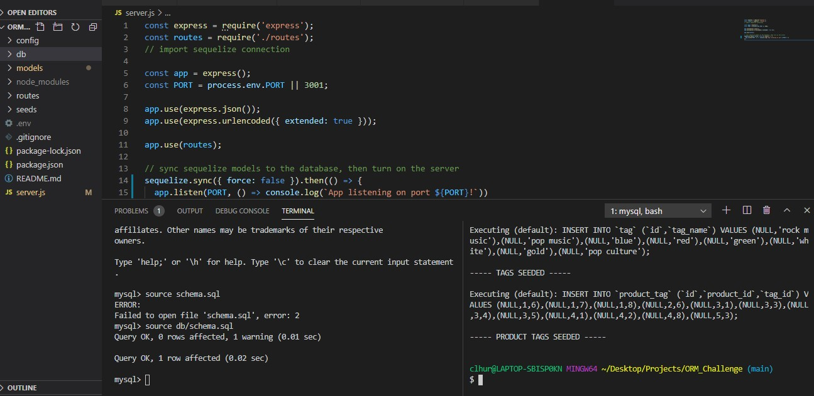
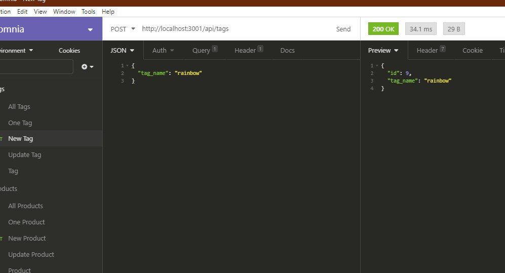

# E-commerce Back End Starter Code Challenge 

  ## Description
   An exercise in creating the backend for a small e-commerce app.

   ```
AS A manager at an internet retail company
I WANT a back end for my e-commerce website that uses the latest technologies
SO THAT my company can compete with other e-commerce companies
```

  ## 💽 Installation
   Clone the code to your computer and open the root folder in the command line. Run the following to install the node dependencies
   ```
   npm install 
   ```
   You will need to enter your MySQL username and password into the .env file
   In the MySQL shell, run the following command
   ```
   source db/schema.sql
   ```
   After this, you can run the following in the command line to populate the database with the seeds.sql files and start the application

   ```
   npm run seed
   npm start 
   ```

  ## ➕ Features
   Express MySQL Sequelize Dotenv 

  ## 💾 Screenshots
  
  
  


 ## 🖥️ Links 
#GitHub: https://github.com/clhurlbut/ORM_Challenge <br>
#Demo Video: https://drive.google.com/file/d/1I2Gr0HVRJRG3E6i2CZABbFnCmGlbhzSy/view <br>


  ## 💖 Credits
   Thank you to UCLA / Trilogy Bootcamp!

  ## 🙋 Questions 
   Please feel free to contact the developer with any questions/comments/concerns. 

   📧 **Email**
   <clhurlbut@gmail.com>

   🔗 **GitHub** 
   [clhurlbut](https://github.com/clhurlbut)


  This README was generated with 🥔 [readmeGenerator](https://github.com/clhurlbut/readmeGenerator)  